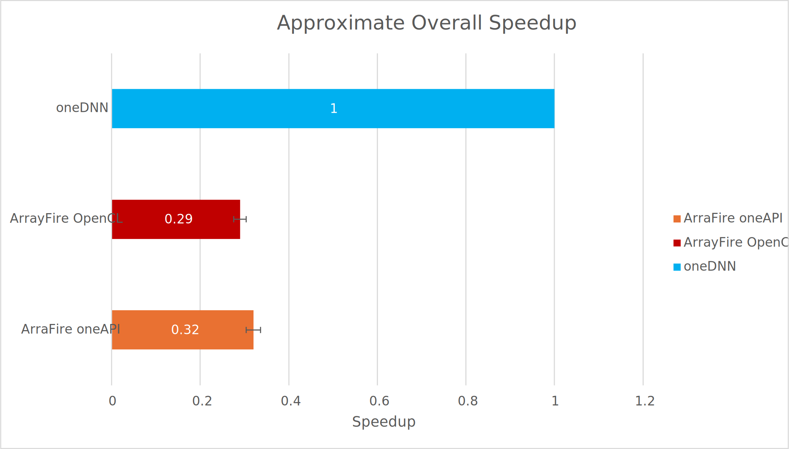

Results
===========

## Introduction

[Whisper.cpp](https://github.com/ggerganov/whisper.cpp) is an an C++ port of [OpenAI's Whisper](https://github.com/openai/whisper) automatic speech recognition model.
Under the hood it supports multiple backend for execution. Among them, there is the Intel's [OpenVINO](https://github.com/openvinotoolkit/openvino) AI Toolkit. It's main advantage and also weakness is that its optimization and support only on
Intel Hardware (CPUs, GPUs, and some ARM CPUs). This support is done with their implementation of models with the [oneDNN oneAPI Deep Neural Network Library](https://github.com/oneapi-src/oneDNN).

Our goal is to find a place in here, where ArrayFire can aid Intel's libraries in the areas of platform support and performance
to justify funding the development of ArrayFire as a HPC library.

## Method

To that end, we proceed to find valuable statistics of the current state of oneDNN and ArrayFire that can sustent their usage.
For that, we investigated Whisper.cpp oneDNN calls to layer computations of the AI model, and determine the primitives used.
With this set of primitives, we can implement equivalent functions to compare the theoretical runtime of running whisper.cpp with
ArrayFire as a backend without having to port the whole model.

We were able to find the following operations:

|   Primitive   |           Times used                              | Approximate Runtime Contribution |
|:-------------:|:-------------------------------------------------:|:--------------------------------:|
|     matmul    | 13x (1x8x1500x1500:1x8x1500x64)                    |             $48.5\\%$           |
| inner product | 6x (1500x512:512x2048) + 12x(1500x512:512x512)    |             $33.6\\%$            |
|    softmax    | 6x (1x8x1500x1500)                                |             $10.1\\%$            |
|    convolve   | ic512oc512_iw3000ow1500kw3sw2pw1 + ic80oc512_iw3000ow3000kw3sw1pw1|$4.4\\%$              |
| Total         |             ------                                |            $96.6\\%$             |

Using this information, we set up benchmarks testing each of the primitives in oneDNN with benchdnn and an equivalent ArrayFire implementation using Google Benchmark.

## Tests and Results

The test were done as follows: 1000 repetitions of 20 iterations of each primitive
To test correctness, we used the inputs and outputs for the primitives benchmarked by benchdnn to ensure that the arrayfire implementation was equivalent.

The units of each of the tables is time in $\text{ms}$ measuring the average runtime of each primitive using the largest input from the operations recollected above.

### CPU Test on Intel Xeon (8-core 16-thread)

With Blocking enabled

ArrayFire v3.9.0 (oneAPI, 64-bit Linux, build 4061db86e)
[0] Intel(R) OpenCL: Intel(R) Xeon(R) CPU @ 2.30GHz, 32082 MB
|   Test   |    ArrayFire oneAPI           |            ArrayFire OpenCL              |        OneDNN                         |
|:--------:|:-----------------------------:|:----------------------------------------:|:-------------------------------------:|
|  matmul  |             $9.87\pm0.21$     |               $14.3\pm2.7$               |  $${\color{lightgreen}4.42\pm0.09}$$  |
|  conv    |             $37.4\pm0.8$      |              $28.1\pm2.8$                |  $${\color{lightgreen}4.61\pm0.16}$$  |
|  softmax |             $32.4\pm0.4$      |              $49.5\pm0.5$                |$${\color{lightgreen}3.07\pm0.06}$$    |
|  inner   |        $14.0\pm0.4$           |             $9.89\pm0.22$                |$${\color{lightgreen}5.59\pm0.11}$$    |

### GPU Test on Intel Arc A770

With Blocking disabled

ArrayFire v3.9.0 (OpenCL/oneAPI, 64-bit Linux, build 4061db86e)
On Intel(R) Level-Zero: Intel(R) Arc(TM) A770 Graphics, 15473 MB (fp16)
|   Test   |           ArrayFire oneAPI            |            ArrayFire OpenCL              |          OneDNN                          |
|:--------:|:-------------------------------------:|:----------------------------------------:|:----------------------------------------:|
|  matmul  |             $0.399\pm0.012$           |               $3.34\pm0.05$              |  $${\color{lightgreen}0.311\pm0.022}$$   |
|  conv    |             $1.61\pm0.10$             | $${\color{lightgreen}{1.14\pm0.01}}$$    |            $0.360\pm0.045$               |
|  softmax |             $6.91\pm0.07$             | $${\color{lightgreen}{1.28\pm0.02}}$$    |            $1.80\pm0.04$                 |
|  inner   | $${\color{lightgreen}0.616\pm0.055}$$ |             $0.828\pm0.019$              |            $0.243\pm 0.019$              |

Using the expression 13*`matmul_runtime`+(6+12\*512/2048)\*`inner_runtime`+6*`softmax_runtime`+2*`conv_runtime`, we can approximate the total expected runtime of the model.

### GPU Test on Nvidia Tesla T4

Benchdnn did not run for the post operation `eltwise_gelu_erf`, so it was replaced for `eltwise_relu` for the convolution and softmax tests as a approximate reference point. OneDNN used SYCL for kernel invocation which used cudnn for certain operations.

With Blocking disabled

ArrayFire v3.9.0 (CUDA, 64-bit Linux, build 4061db86e)
Platform: CUDA Runtime 12.3, Driver: 545.29.06
[0] Tesla T4, 14930 MB, CUDA Compute 7.5
|   Test   |           ArrayFire Cuda              |            ArrayFire OpenCL              | OneDNN (relu instead of gelu_erf)      |
|:--------:|:-------------------------------------:|:----------------------------------------:|:--------------------------------------:|
|  matmul  |$${\color{lightgreen}0.600\pm0.039}$$  |               $2.25\pm0.15$              |            $1.04\pm0.02$               |
|  conv    |             $1.48\pm0.02$             |             $2.01\pm0.02$                |  $$\color{lightgreen}0.91\pm0.03$$     |
|  softmax |             $1.83\pm0.04$             |             $1.84\pm0.03$                |  $$\color{lightgreen}0.978\pm0.001$$   |
|  inner   | $${\color{lightgreen}0.737\pm0.014}$$ |             $1.20\pm0.01$                |            $1.29\pm 0.03$              |

